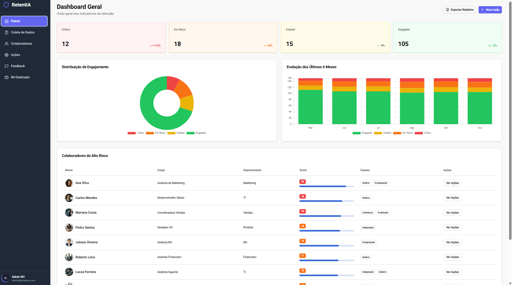
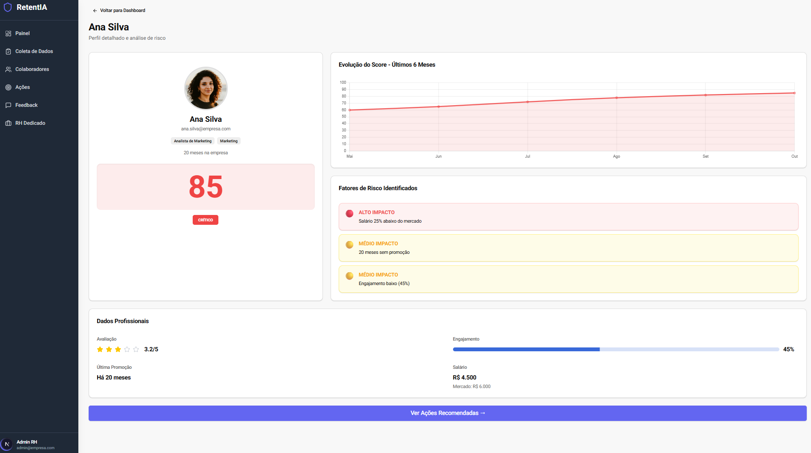

# 🏆 RetentIA Platform

<div align="center">
  
  
  
  
  

</div>

<br />

<p align="center">
  <strong>Plataforma preditiva de retenção de talentos</strong>
  <br />
  🥇 Vencedor do Hackathon FATEC Ribeirão Preto - Outubro 2024
</p>

---

## 📋 Índice

- [Sobre o Projeto](#-sobre-o-projeto)
- [Demonstração](#-demonstração)
- [Problema e Solução](#-problema-e-solução)
- [Funcionalidades](#-funcionalidades)
- [Algoritmo de Score](#-algoritmo-de-score)
- [Tecnologias](#-tecnologias)
- [Instalação](#-instalação)
- [Estrutura do Projeto](#-estrutura-do-projeto)
- [Roadmap](#-roadmap)
- [Autor](#-autor)

---

## 📊 Sobre o Projeto

**RetentIA** é uma plataforma web desenvolvida durante um hackathon de 48 horas que propõe uma solução para prever o risco de turnover (rotatividade) de colaboradores em empresas. O sistema analisa múltiplos fatores comportamentais e organizacionais para gerar um score preditivo de risco de desligamento.

### 🎯 Status Atual

Este é um **MVP (Minimum Viable Product)** desenvolvido como proof of concept, utilizando dados mockados (fictícios) para demonstração. O projeto valida a viabilidade técnica e a experiência do usuário da solução proposta.

---

## 🎨 Demonstração

### Dashboard Principal
<div align="center">
  
  <p><em>Visão geral dos indicadores de retenção organizacional</em></p>
</div>

### Perfil do Colaborador
<div align="center">
  
  <p><em>Análise detalhada individual com score de risco e recomendações</em></p>
</div>

---

## 💡 Problema e Solução

### O Problema

A rotatividade de funcionários (turnover) é um desafio crítico para empresas brasileiras:

- Taxa média no Brasil: **30-50% ao ano** em diversos setores
- Custo por desligamento: **6-9 meses de salário** do colaborador
- Impacto financeiro: Estima-se em **centenas de bilhões** anualmente no mercado brasileiro
- Custos incluem: recrutamento, treinamento, perda de produtividade e conhecimento

### A Solução Proposta

RetentIA oferece uma abordagem **proativa** ao identificar colaboradores em risco de saída com antecedência de 3-6 meses, permitindo:

- Intervenções preventivas baseadas em dados
- Priorização de ações de retenção
- Análise de causas raiz por colaborador
- Recomendações automáticas de ações

---

## ✨ Funcionalidades

### Implementadas (MVP)
- ✅ **Dashboard Executivo** - Indicadores consolidados de risco organizacional
- ✅ **Score Preditivo** - Algoritmo baseado em múltiplos fatores (0-100)
- ✅ **Perfis Individuais** - Análise detalhada por colaborador
- ✅ **Motor de Recomendações** - Sugestões automáticas de intervenção
- ✅ **Gestão de Ações** - Rastreamento de medidas preventivas
- ✅ **Interface em PT-BR** - Totalmente em português brasileiro
- ✅ **Dados Mockados** - Dataset fictício para demonstração

### Planejadas (Roadmap)
- ⏳ Responsividade mobile (Android/iOS)
- ⏳ Integração com banco de dados real (Supabase)
- ⏳ Sistema de autenticação de usuários
- ⏳ APIs de integração com sistemas de RH

---

## 🧮 Algoritmo de Score

O sistema calcula um score de risco (0-100) baseado em **6 categorias** com pesos diferenciados:

| Categoria | Peso | Justificativa |
|-----------|------|---------------|
| **Tempo de Empresa** | 25% | Período crítico entre 6-24 meses apresenta maior risco |
| **Compensação** | 25% | Diferença salarial vs. mercado é principal fator de saída |
| **Engajamento** | 20% | Participação em atividades indica nível de satisfação |
| **Desenvolvimento** | 15% | Estagnação profissional motiva busca por oportunidades |
| **Feedback Negativo** | 10% | Histórico de insatisfações indica risco elevado |
| **Outros Indicadores** | 5% | Fatores complementares (faltas, atrasos, etc) |

### Fórmula Simplificada
```
Score = Σ (Fator_i × Peso_i)

Onde cada fator gera uma pontuação de 0-100 baseada em regras específicas
```

### Interpretação

- **85-100**: 🔴 Risco Alto - Ação imediata recomendada
- **60-84**: 🟡 Risco Médio - Monitoramento próximo necessário
- **40-59**: 🟢 Estável - Situação normal
- **0-39**: 💚 Engajado - Colaborador satisfeito

> **Nota**: Este é um algoritmo de demonstração. Uma implementação em produção requereria machine learning com dados históricos reais de turnover para calibração precisa dos pesos e regras.

---

## 🚀 Tecnologias

### Core
- **[Next.js 16](https://nextjs.org/)** - Framework React com App Router
- **[TypeScript](https://www.typescriptlang.org/)** - Linguagem principal (97.5% do código)
- **[Tailwind CSS](https://tailwindcss.com/)** - Estilização com utility-first

### Bibliotecas
- **[Lucide React](https://lucide.dev/)** - Sistema de ícones
- **[Recharts](https://recharts.org/)** - Visualização de dados
- **[shadcn/ui](https://ui.shadcn.com/)** - Componentes acessíveis

### Ferramentas
- **[Git](https://git-scm.com/)** - Controle de versão
- **[GitHub](https://github.com/)** - Hospedagem de código
- **[VSCode](https://code.visualstudio.com/)** - Editor de código

---

## 💻 Instalação

### Pré-requisitos

- Node.js 20.x ou superior
- npm ou yarn
- Git

### Passos
```bash
# Clone o repositório
git clone https://github.com/GVell/retentia-platform.git

# Navegue até o diretório
cd retentia-platform

# Instale as dependências
npm install --legacy-peer-deps

# Inicie o servidor de desenvolvimento
npm run dev
```

Acesse [http://localhost:3000](http://localhost:3000) no navegador.

### Scripts Disponíveis
```bash
npm run dev      # Servidor de desenvolvimento
npm run build    # Build de produção
npm run start    # Servidor de produção
npm run lint     # Verificação de código
```

---

## 📁 Estrutura do Projeto
```
retentia-platform/
│
├── app/                      # Next.js App Router
│   ├── layout.tsx           # Layout raiz da aplicação
│   ├── page.tsx             # Página principal (dashboard)
│   └── globals.css          # Estilos globais
│
├── components/              # Componentes React reutilizáveis
│   ├── dashboard.tsx        # Componente principal do dashboard
│   ├── sidebar.tsx          # Navegação lateral
│   ├── employee-profile.tsx # Visualização de perfil individual
│   ├── employee-list.tsx    # Lista/tabela de colaboradores
│   └── [outros componentes]
│
├── lib/                     # Utilitários e funções auxiliares
│   ├── risk-utils.ts        # Lógica de cálculo do score de risco
│   └── utils.ts             # Funções helper gerais
│
├── public/                  # Assets estáticos (imagens, ícones)
│
├── assets/                  # Recursos do projeto
│   └── screenshots/         # Imagens para documentação
│
├── .gitignore              # Arquivos ignorados pelo Git
├── next.config.mjs         # Configuração do Next.js
├── tailwind.config.ts      # Configuração do Tailwind
├── tsconfig.json           # Configuração do TypeScript
├── package.json            # Dependências e scripts
└── README.md               # Documentação (este arquivo)
```

---

## 🎯 Roadmap

### ✅ Fase 1 - MVP (Concluído)
- [x] Protótipo funcional em 48h (Hackathon)
- [x] Interface completa com dados mockados
- [x] Algoritmo de score implementado
- [x] Design system baseado em Tailwind
- [x] Documentação inicial

### 🔄 Fase 2 - Refinamento (Em Progresso)
- [x] Versionamento com Git/GitHub
- [x] README profissional com documentação
- [ ] Otimização para dispositivos móveis
- [ ] Testes de usabilidade e ajustes de UX

### 📋 Fase 3 - Produtização (Planejado)
- [ ] Migração de dados mockados para banco real (Supabase)
- [ ] Sistema de autenticação e autorização
- [ ] API endpoints para integração externa
- [ ] Deploy em ambiente de produção (Vercel/AWS)
- [ ] Testes automatizados (Jest, React Testing Library)

### 🚀 Fase 4 - Escala (Futuro)
- [ ] Machine Learning para predição otimizada
- [ ] Integrações com ERPs de RH (Gupy, SAP, ADP)
- [ ] Dashboard executivo avançado com drill-down
- [ ] Exportação de relatórios (PDF, Excel)
- [ ] Sistema de notificações e alertas
- [ ] Módulo de benchmarking setorial

---

## 🏆 Contexto do Desenvolvimento

Este projeto foi desenvolvido durante o **Hackathon FATEC Ribeirão Preto** (Outubro 2024), onde conquistou o **primeiro lugar**. 

**Desafios Superados:**
- ⚡ Desenvolvimento completo em **48 horas**
- 🎨 Design e implementação de interface profissional
- 🧮 Criação de algoritmo funcional de scoring
- 📊 Integração de múltiplos componentes e bibliotecas
- 🎤 Apresentação técnica e pitch de negócio

**Aprendizados:**
- Prototipagem rápida com Next.js e TypeScript
- Design de sistemas de scoring preditivo
- Desenvolvimento solo sob pressão de tempo
- Comunicação técnica e apresentação de produto

---

## 📝 Licença

Este projeto está sob a licença MIT. Consulte o arquivo [LICENSE](LICENSE) para mais detalhes.

---

## 👨‍💻 Autor

**Lucas Velloso**

- GitHub: [@GVell](https://github.com/GVell)
- LinkedIn: [Adicione seu LinkedIn aqui]
- Email: [Adicione seu email profissional aqui]

---

## 🤝 Contribuições

Contribuições, issues e feature requests são bem-vindos!

Sinta-se à vontade para verificar a [página de issues](https://github.com/GVell/retentia-platform/issues).

---

## 🙏 Agradecimentos

- **FATEC Ribeirão Preto** - Pela organização do hackathon
- **Comunidade Next.js** - Pela excelente documentação
- **shadcn/ui** - Pelos componentes de alta qualidade

---

<div align="center">
  <p>Desenvolvido com ❤️ durante o Hackathon FATEC-RP 2024</p>
  <p><strong>⭐ Se este projeto foi útil, considere deixar uma estrela no GitHub!</strong></p>
</div>